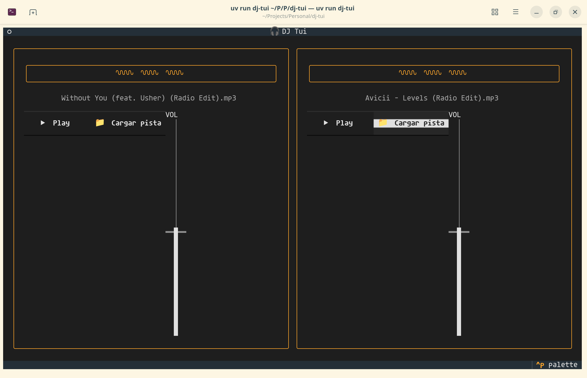

# DJ Tui 🎧


DJ Tui is a DJ mixer on the terminal that can be controlled with a DDJ-200 MIDI controller.

It's all written in Python, using the [Textual](https://textual.textualize.io/) framework to generate the TUI.

To launch it, clone the repository and run:

```bash
$ uv run dj-tui
```



## Architecture

We combine three modules to build the application:
* [dj_tui.controller](dj_tui/controller.py): Handles MIDI controller input and translates it into application actions
* [dj_tui.audio](dj_tui/audio.py): Manages audio loading and play-pause
* [dj_tui.ui](dj_tui/ui.py): Handles the TUI and user interaction

The three modules are managed by the main application logic controller: [dj_tui.app](dj_tui/app.py)

---

### Development notes

#### Inspiration

Open source, multi-platform DJ software exists: [Mixxx](https://mixxx.org/).

We want to do something similar, with a Terminal User Interface (TUI).
Our framework of choice is [Textual](https://textual.textualize.io/).

#### MVP

A Python package that can be installed as follows

```
$ pip install dj-tui
```

That launches a TUI with the following capabilities:

- Loading an MP3 on the left deck
- Loading an MP3 on the right deck
- Setting and playing a single cue point on the left and right track
- Controlling the volume of the left and right track independently
- These actions can be performed with a DJ controller, for example a Pioneer DDJ-200,
  as well as with basic keyboard shortcuts (for those who don't possess one)

#### Extras

- Display waveform of tracks
- Visual representation of the jog wheels
- Other audio formats
- Tempo controls
- Equalizers (knobs to tweak low, mid, high frequencies)
- ...? (Ideas welcome!)

#### Resources

MIDI and DJ controllers:

- https://manual.mixxx.org/2.4/en/hardware/controllers/pioneer_ddj_200
- https://web.archive.org/web/20250910180949/https://www.pioneerdj.com/-/media/pioneerdj/software-info/controller/ddj-200/ddj-200_midi_message_list_e2.pdf
- https://pypi.org/project/mido/
- https://pypi.org/project/flx4py/ (Pioneer DDJ-FLX4)

TUI inspiration:

- https://github.com/oleksis/awesome-textualize-projects

Playing audio:

- https://pypi.org/project/sounddevice/
- https://pypi.org/project/soundfile/
